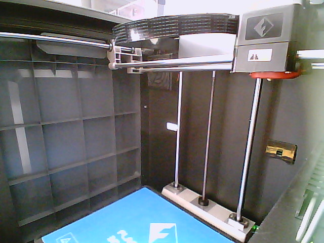

# 3D Print Spaghetti AI

[](LICENSE)
[](https://developers.home-assistant.io/docs/apps/repository/)
[](spaghetti_ai/build.yaml)
[](#safety-model)

A local, CPU-only print-failure detector for the FlashForge Guider 2S that watches camera snapshots and reports confirmed events to Home Assistant over MQTT.




## Try it

There is no public demo. The project runs inside a local Home Assistant installation and requires access to a printer camera and an MQTT broker.

This repository is a **Home Assistant app repository**, not a HACS custom integration. Apps are added from the Home Assistant App store; HACS is for custom integrations, dashboard plugins, and other Home Assistant content.

### Home Assistant quick start

1. Create and verify a Home Assistant backup.
2. In **Settings → Apps → App store → Repositories**, add `https://github.com/Gerafftes/3D-print-Spaghetti-ai`.
3. Install **3D Print Spaghetti AI**, enter your camera snapshot URL, and keep `shadow_mode: true` while validating the detector.

A typical Guider 2S snapshot URL has the form `http://PRINTER_IP:8080/?action=snapshot`. Do not expose the camera or the status API to the public internet.

Apps are available on Home Assistant OS and Supervised installations. See the [official app repository guide](https://developers.home-assistant.io/docs/apps/repository/) for the repository workflow.

## What it does

- Reads individual printer-camera snapshots without sending commands to the printer.
- Runs the pinned Obico ONNX model locally with one CPU thread.
- Requires three positive frames within the latest five before confirming an event.
- Publishes online state, detection state, score, and confirmed events over MQTT.
- Stores original images, annotated images, and event metadata for seven days.
- Starts in shadow mode, where detections are recorded but cannot trigger the phone decision workflow.

## Current status

| Capability | Status |
| --- | --- |
| Detector, state machine, storage, HTTP API, and MQTT discovery | Implemented |
| Automated unit tests | 8 passed locally on 16 August 2026 |
| Home Assistant app installation and camera transport | Verified on the local setup |
| Two complete shadow-mode print evaluations | Not completed yet |
| Phone notification with image | Prepared, but disabled and untested |
| Controlled pause/continue decision | Disabled and untested |
| Production-ready automatic intervention | No |

The detector is currently being evaluated in shadow mode. A running service and a reachable camera do not prove detection accuracy.

## Safety model

The detector has no FlashForge control protocol and cannot pause or abort a print by itself. In shadow mode, confirmed events are published only to `spaghetti_ai/shadow_alert`.

The planned production flow keeps the final decision with the user:

1. Home Assistant sends a notification containing the event image.
2. The user chooses whether to continue or pause.
3. Home Assistant may call only the existing pause button after a separate controlled test.

Abort commands and raw printer commands are outside this project's scope.

## How detection works

The app fetches a snapshot every five seconds and scales the configured region of interest to at most 320 pixels on its longest edge. ONNX Runtime performs CPU inference with one intra-op and one inter-op thread and without its CPU memory arena.

A single high score is not enough to create an event. The state machine looks at a five-frame window, requires at least three positive frames, and requires their average confidence to reach `0.65`. This reduces one-frame false alarms at the cost of a short confirmation delay.

The service exposes these local HTTP endpoints on port `8099`:

- `/health`
- `/status`
- `/latest.jpg`
- `/alerts/latest.jpg`

## Local development

Requirements: Python 3.11 and the native libraries required by OpenCV and ONNX Runtime. From the `spaghetti_ai` directory:

```sh
python3.11 -m venv .venv
.venv/bin/pip install -e '.[test]'
.venv/bin/python -m pytest -q
```

The container downloads the pinned Obico model during the build and verifies SHA-256 `0a6ebd8e30dbf6a450c50f9c0a5406f04ba7eb1c99fd5996e888c78bb383b9aa` before installing it.

## Credits and license

The model format and CPU post-processing are based on [Obico's `ml_api` at revision `49c0bc7`](https://github.com/TheSpaghettiDetective/obico-server/tree/49c0bc7001a3fd8d56297fc3032ba287bfe1d50b/ml_api). The pinned model is `model-weights-5a6b1be1fa.onnx`.

This project is licensed under the [GNU Affero General Public License v3.0 only](LICENSE).
